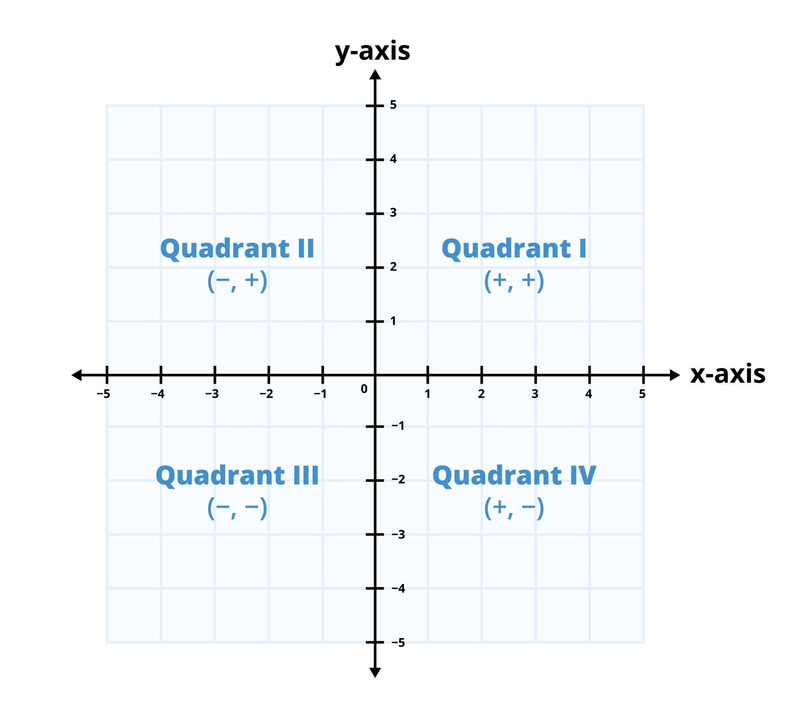

# Nearest Campsites I - Lời giải

**ID:** 3306 | **URL:** https://cses.fi/problemset/task/3306

## Đề bài

Trên một lưới tọa độ, có $n$ chỗ cắm trại đã đặt trước (ký hiệu là $R$) và $m$ chỗ trống (ký hiệu là $F$). Nhiệm vụ của bạn là tìm khoảng cách Manhattan lớn nhất từ một chỗ trống đến chỗ đã đặt gần nhất.

## Hướng tiếp cận

### 1. Phân tích hình học: 4 Góc phần tư

Khoảng cách Manhattan $|x_F - x_R| + |y_F - y_R|$ có thể phá dấu giá trị tuyệt đối thành 4 trường hợp tùy thuộc vào vị trí của điểm đã đặt $R$ so với điểm trống $F$. Để tìm điểm gần nhất, ta chia mặt phẳng xung quanh mỗi điểm $F$ thành 4 góc phần tư:

> **Chú thích ảnh:** Xét điểm $F$ là gốc tọa độ. Quadrant III (dấu $-,-$) tương ứng với vùng **Trái - Dưới**, Quadrant II (dấu $-,+$) tương ứng với vùng **Trái - Trên**, Quadrant IV (dấu $+,-$) tương ứng với vùng **Phải - Dưới**, Quadrant I (dấu $+,+$) tương ứng với vùng **Phải - Trên**.

- **Góc Trái - Dưới** ($x_R \le x_F, y_R \le y_F$):
  $d = (x_F - x_R) + (y_F - y_R) = (x_F + y_F) - (x_R + y_R)$.
  $\to$ Cần tìm điểm $R$ có **$(x_R + y_R)$ lớn nhất**.
- **Góc Trái - Trên** ($x_R \le x_F, y_R > y_F$):
  $d = (x_F - x_R) + (y_R - y_F) = (x_F - y_F) - (x_R - y_R)$.
  $\to$ Cần tìm điểm $R$ có **$(x_R - y_R)$ lớn nhất**.
- **Góc Phải - Dưới** ($x_R > x_F, y_R \le y_F$):
  $d = (x_R - x_F) + (y_F - y_R) = (-x_F + y_F) - (-x_R + y_R)$.
  $\to$ Cần tìm điểm $R$ có **$(-x_R + y_R)$ lớn nhất**.
- **Góc Phải - Trên** ($x_R > x_F, y_R > y_F$):
  $d = (x_R - x_F) + (y_R - y_F) = (-x_F - y_F) - (-x_R - y_R)$.
  $\to$ Cần tìm điểm $R$ có **$(-x_R - y_R)$ lớn nhất**.

### 2. Thuật toán Quét và Cây Fenwick (BIT)

Vì mỗi điểm $F$ cần tìm điểm $R$ gần nhất trong cả 4 vùng, ta thực hiện 4 lượt quét. Mỗi lượt chỉ giải quyết **duy nhất vùng Trái - Dưới** bằng cách biến đổi tọa độ:

1. **Sắp xếp:** Sắp xếp tất cả điểm $R$ và $F$ theo trục $x$ tăng dần. Điều này đảm bảo khi xét đến $F$, các điểm $R$ đã duyệt qua đều thỏa mãn $x_R \le x_F$.
2. **Sử dụng BIT:** Dùng BIT để quản lý các giá trị theo trục $y$.
   - Khi gặp điểm $R$: Cập nhật vào BIT tại vị trí $y_R$ giá trị $(x_R + y_R)$. BIT sẽ lưu giá trị **lớn nhất**.
   - Khi gặp điểm $F$: Truy vấn BIT lấy giá trị lớn nhất trong khoảng $[0, y_F]$. Khoảng cách tạm thời là $(x_F + y_F) - \text{BIT.query}(y_F)$.
3. **Xoay tọa độ:** Sau mỗi lượt, ta lật tọa độ (ví dụ: $y = -y$ hoặc $x = -x$) để đưa các góc phần tư khác về vị trí Trái - Dưới và chạy lại thuật toán trên.

### 3. Tổng hợp kết quả

- Với mỗi điểm trống $F$, sau 4 lượt quét, ta lấy giá trị nhỏ nhất trong 4 khoảng cách tìm được.
- Đáp án cuối cùng là giá trị **lớn nhất** trong số các khoảng cách nhỏ nhất đó.

### Chứng minh tính đúng đắn

- **Phân rã khoảng cách:** Việc phá dấu giá trị tuyệt đối thành 4 biểu thức $f(x_F, y_F) - f(x_R, y_R)$ đảm bảo rằng với mọi vị trí của $R$, luôn có ít nhất một lượt quét tính đúng khoảng cách Manhattan thực tế.
- **Tính tối ưu của BIT:** Trong mỗi góc phần tư, khoảng cách nhỏ nhất tương ứng với việc tìm giá trị biến đổi $f(x_R, y_R)$ lớn nhất. BIT với thao tác `update_max` và `query_max` giải quyết hoàn hảo bài toán tìm cực trị trên miền dữ liệu 2D đã được quét một trục.

## Ví dụ minh họa chi tiết

Giả sử có 2 điểm đã đặt $R_1(1,1), R_2(5,2)$ và 1 điểm trống $F(7,5)$.

**Lượt quét Trái - Dưới** ($x_R \le 7, y_R \le 5$):

Cả $R_1(1,1)$ và $R_2(5,2)$ đều thỏa mãn điều kiện nằm ở Góc Trái - Dưới của $F$.

Giá trị biến đổi $f(x, y) = x + y$:

- Tại $R_1$: $f = 1 + 1 = 2$.
- Tại $R_2$: $f = 5 + 2 = 7$.
- BIT lưu trữ $\max(2, 7) = 7$ tại các chỉ số $y \le 5$.

Khi xét điểm trống $F(7,5)$:

- $f(F) = 7 + 5 = 12$.
- Khoảng cách gần nhất từ hướng này: $12 - 7 = 5$.

**Kết quả cuối cùng:**

Điểm trống $F(7,5)$ sau khi quét đủ 4 hướng sẽ tìm được khoảng cách gần nhất là $5$ (đến $R_2$). Nếu có thêm điểm trống $F_2$ có khoảng cách gần nhất là $2$, đáp án bài toán sẽ là $\max(5, 2) = 5$.

### Ví dụ theo đề bài

4 điểm đã đặt: $R_1(1,1), R_2(5,2), R_3(2,6), R_4(4,7)$. 2 điểm trống: $F_1(1,3), F_2(7,5)$.

**Lượt quét Trái - Dưới** ($x_R \le x_F, y_R \le y_F$):

Xử lý theo thứ tự $x$ tăng dần (điểm $R$ trước điểm $F$ cùng $x$):

1. $R_1(1,1)$: cập nhật BIT tại $y=1$, giá trị $1+1=2$.
2. $F_1(1,3)$: truy vấn BIT tại $y=3$, $\max = 2$. Khoảng cách = $(1+3)-2 = 2$.
3. $R_3(2,6)$: cập nhật BIT tại $y=6$, giá trị $2+6=8$.
4. $R_4(4,7)$: cập nhật BIT tại $y=7$, giá trị $4+7=11$.
5. $R_2(5,2)$: cập nhật BIT tại $y=2$, giá trị $5+2=7$.
6. $F_2(7,5)$: truy vấn BIT tại $y=5$, $\max$ trong $[0,5]$ là $7$ (từ $R_2$ tại $y=2$). Khoảng cách = $(7+5)-7 = 5$.

Sau 4 lượt quét:
- $F_1(1,3)$: khoảng cách gần nhất = $2$ (đến $R_1$).
- $F_2(7,5)$: khoảng cách gần nhất = $5$ (đến $R_2$).

Đáp án: $\max(2, 5) = \mathbf{5}$.

## Độ phức tạp

- **Thời gian:** $O((n + m) \log (\max Y))$ — Tổng cộng 4 lượt quét, mỗi lượt tốn thời gian sắp xếp và thao tác trên BIT.
- **Bộ nhớ:** $O(n + m)$ — Lưu trữ tọa độ và kết quả cho từng điểm trống.

## Mã nguồn (C++)

[Mã nguồn](../code/Nearest%20Campsites%20I.cpp)
